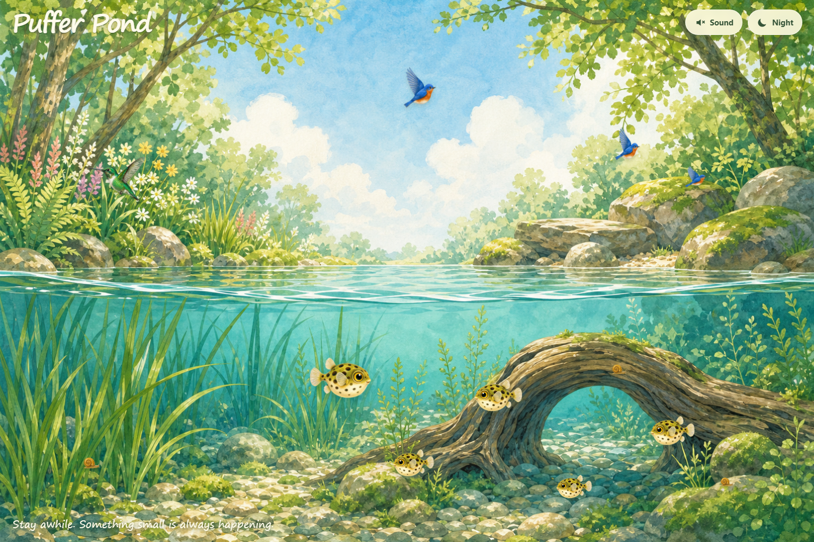

# Puffer Pond

Puffer Pond is a responsive, full-screen living illustration: a family of pea puffers explores grass and driftwood for snails while birds, a green hummingbird, and two thirsty dogs visit the water above.



Tap or click the water to make a ripple. The top-right controls enable gentle pond sounds and switch between day and night. Sound remains off until the visitor explicitly enables it.

## How This Project Is Run

Project truth is split across four control documents:

- `AGENTS.md` - agent boundaries, engineering rules, and proof requirements.
- `BLUEPRINT.md` - product identity, architecture, invariants, and non-goals.
- `TASKBOARD.md` - current status, hot work queue, and owner decisions.
- `RUNBOOK.md` - exact setup, verification, deployment, and recovery commands.

Capability behavior and acceptance evidence live in `specs/ambient-pond.md`.

## Getting Started

```powershell
npm.cmd install
npm.cmd run dev -- --host 127.0.0.1
```

Open `http://127.0.0.1:5173`.

```powershell
npm.cmd test
npm.cmd run build
```

## Working With Agents

Read `AGENTS.md`, then `TASKBOARD.md`, then the active capability spec before making changes. Visible changes require desktop and phone-sized browser proof in addition to tests and a production build.

## Project Status

The Genesis slice and complete ambient scene are implemented. See `TASKBOARD.md` for optional next enhancements and `specs/ambient-pond.md` for acceptance evidence.

## License

MIT. See `LICENSE`.
